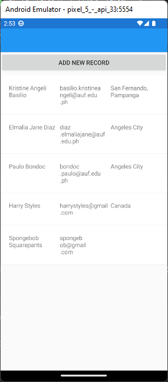
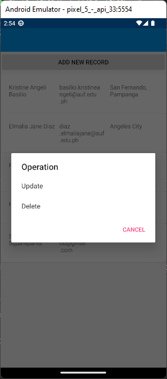
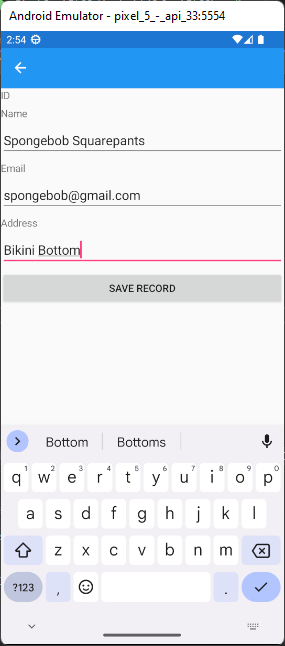
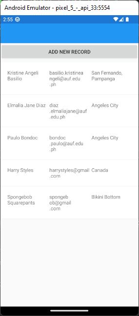
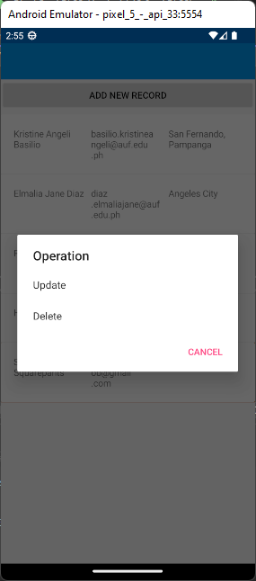

# Module06MVVM
## Output Screenshots

<table>
  <tr>
    ### Add New Record
    <td></td>
    <td></td>
    <td></td>
  </tr>

  <tr>
    ### Update Record
    <td></td>
    <td></td>
    <td></td>
    <td></td>
  </tr>

  <tr>
    ### Delete Record
    <td></td>
    <td></td>
    <td></td>
  </tr>
</table>
